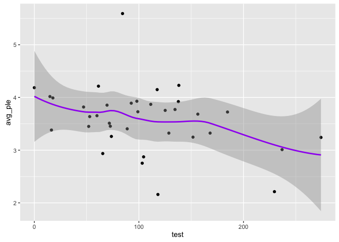
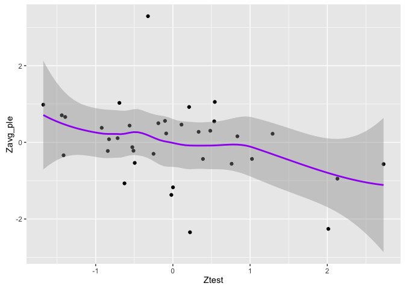
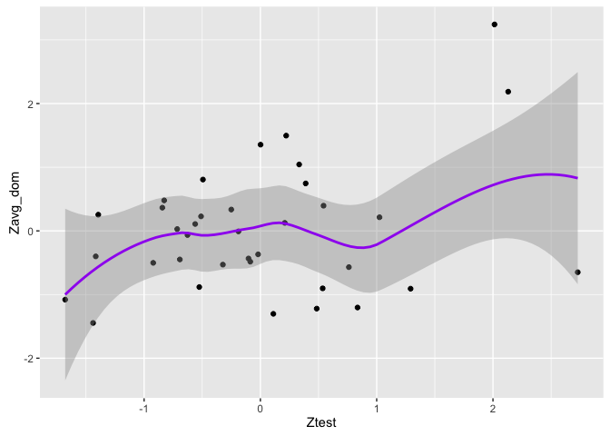
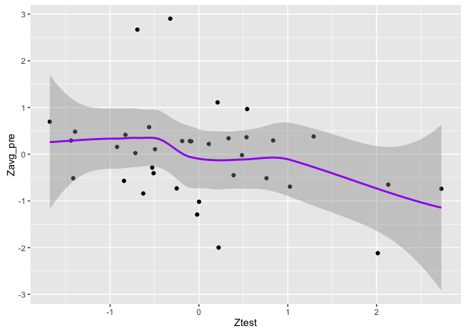
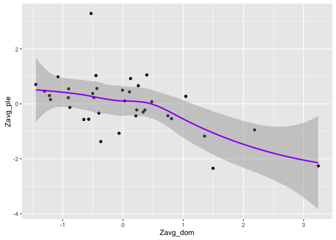

GraphsT1
================
Marlise Hofer
November 19, 2016

    ## Loading tidyverse: ggplot2
    ## Loading tidyverse: tibble
    ## Loading tidyverse: tidyr
    ## Loading tidyverse: readr
    ## Loading tidyverse: purrr
    ## Loading tidyverse: dplyr

    ## Conflicts with tidy packages ----------------------------------------------

    ## filter(): dplyr, stats
    ## lag():    dplyr, stats

Plot T against pleasantness & compute correlation
=================================================

ave\_ple=plesantness

    ## 
    ##  Pearson's product-moment correlation
    ## 
    ## data:  data$avg_ple and data$test
    ## t = -2.1876, df = 34, p-value = 0.03567
    ## alternative hypothesis: true correlation is not equal to 0
    ## 95 percent confidence interval:
    ##  -0.60946088 -0.02568568
    ## sample estimates:
    ##        cor 
    ## -0.3512573

correlation - r=0.035 p=.036

Exact same results with Zscored variables
=========================================

Pleasantness has one variable with Zscore of over 3
===================================================

What happens when we filter out that variable?

    ## 
    ##  Pearson's product-moment correlation
    ## 
    ## data:  data1$Zavg_ple and data1$Ztest
    ## t = -2.4201, df = 33, p-value = 0.02118
    ## alternative hypothesis: true correlation is not equal to 0
    ## 95 percent confidence interval:
    ##  -0.63883545 -0.06316762
    ## sample estimates:
    ##        cor 
    ## -0.3882415

correlation is stronger - r=0.039 p=.021

Now let's check the correlation while also removing the clean shirt
===================================================================

    ## 
    ##  Pearson's product-moment correlation
    ## 
    ## data:  data2$Zavg_ple and data2$Ztest
    ## t = -2.0911, df = 32, p-value = 0.04454
    ## alternative hypothesis: true correlation is not equal to 0
    ## 95 percent confidence interval:
    ##  -0.613015741 -0.009698258
    ## sample estimates:
    ##        cor 
    ## -0.3467268

correlation - r=0.035 p = .044. Correlation is still there and significant.

Okay, now I'll look at graphs of dominance and prestige with T
==============================================================

Now I'll look at a graph of dominance with pleasantness
=======================================================

    ## 
    ##  Pearson's product-moment correlation
    ## 
    ## data:  data$Zavg_ple and data$Zavg_dom
    ## t = -3.9663, df = 34, p-value = 0.0003566
    ## alternative hypothesis: true correlation is not equal to 0
    ## 95 percent confidence interval:
    ##  -0.7520134 -0.2869149
    ## sample estimates:
    ##        cor 
    ## -0.5624346

correlation r=0.56 p=.0004

Take out the outlier in dominance (over 3 Zscore)
=================================================

    ## 
    ##  Pearson's product-moment correlation
    ## 
    ## data:  data3$Zavg_ple and data3$Zavg_dom
    ## t = -2.9195, df = 33, p-value = 0.006274
    ## alternative hypothesis: true correlation is not equal to 0
    ## 95 percent confidence interval:
    ##  -0.6831629 -0.1411211
    ## sample estimates:
    ##       cor 
    ## -0.453061

correlation r=0.45 p=.006. No real change.

Graphs of prestige with pleasantness
====================================

    ## 
    ##  Pearson's product-moment correlation
    ## 
    ## data:  data$Zavg_ple and data$Zavg_pre
    ## t = 14.673, df = 34, p-value = 2.843e-16
    ## alternative hypothesis: true correlation is not equal to 0
    ## 95 percent confidence interval:
    ##  0.8648122 0.9636367
    ## sample estimates:
    ##       cor 
    ## 0.9293106

correlation r=0.93

There seems to be no indication of any trend other than linear trends
=====================================================================
