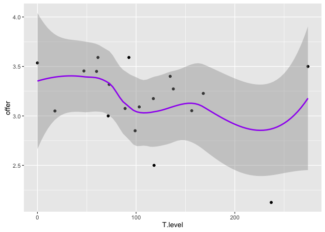

GraphsT2
================
Marlise Hofer
November 19, 2016

Exploring the T Study 2 data for only men
=========================================

    ## Loading tidyverse: ggplot2
    ## Loading tidyverse: tibble
    ## Loading tidyverse: tidyr
    ## Loading tidyverse: readr
    ## Loading tidyverse: purrr
    ## Loading tidyverse: dplyr

    ## Conflicts with tidy packages ----------------------------------------------

    ## filter(): dplyr, stats
    ## lag():    dplyr, stats

Plot T against pleasantness & compute correlation
=================================================

    ## 
    ##  Pearson's product-moment correlation
    ## 
    ## data:  data$T.level and data$offer
    ## t = -1.5159, df = 17, p-value = 0.1479
    ## alternative hypothesis: true correlation is not equal to 0
    ## 95 percent confidence interval:
    ##  -0.6909793  0.1294245
    ## sample estimates:
    ##      cor 
    ## -0.34507

This could be interesting if we had more data!!
===============================================
