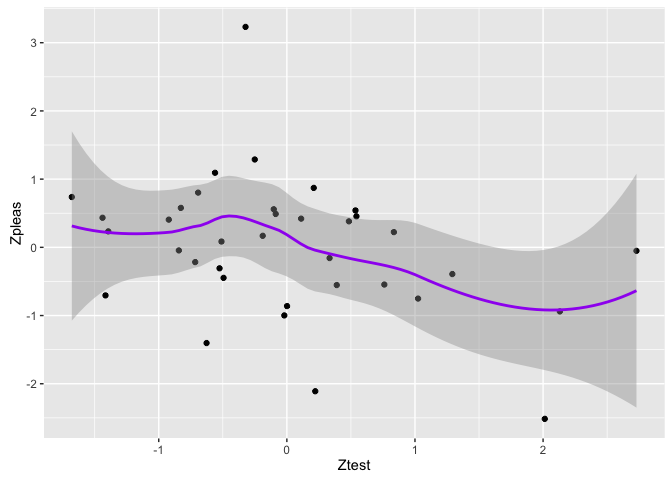
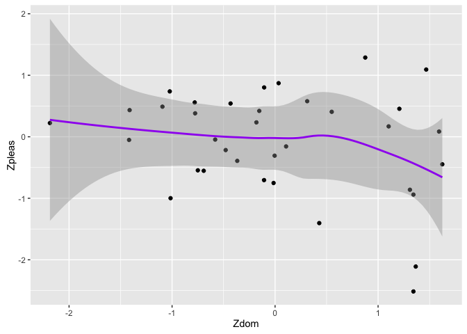
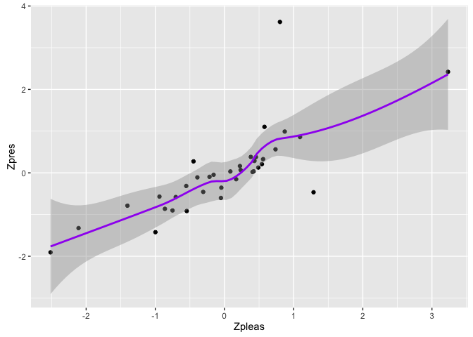

GraphsT1
================
Marlise Hofer
November 19, 2016

Exploring the T Study 1 data for only men
=========================================

    ## Loading tidyverse: ggplot2
    ## Loading tidyverse: tibble
    ## Loading tidyverse: tidyr
    ## Loading tidyverse: readr
    ## Loading tidyverse: purrr
    ## Loading tidyverse: dplyr

    ## Conflicts with tidy packages ----------------------------------------------

    ## filter(): dplyr, stats
    ## lag():    dplyr, stats

Plot T against pleasantness & compute correlation
=================================================

    ## 
    ##  Pearson's product-moment correlation
    ## 
    ## data:  data$Zpleas and data$Ztest
    ## t = -2.0825, df = 34, p-value = 0.04489
    ## alternative hypothesis: true correlation is not equal to 0
    ## 95 percent confidence interval:
    ##  -0.598714297 -0.008768588
    ## sample estimates:
    ##        cor 
    ## -0.3363354

Pleasantness has one variable with Zscore of over 3
===================================================

What happens when we filter out that variable?

    ## 
    ##  Pearson's product-moment correlation
    ## 
    ## data:  data1$Zpleas and data1$Ztest
    ## t = -2.2719, df = 33, p-value = 0.02974
    ## alternative hypothesis: true correlation is not equal to 0
    ## 95 percent confidence interval:
    ##  -0.62448034 -0.03934398
    ## sample estimates:
    ##        cor 
    ## -0.3677686

Now let's check while also removing the clean shirt
===================================================

    ## 
    ##  Pearson's product-moment correlation
    ## 
    ## data:  data2$Zpleas and data2$Ztest
    ## t = -2.0278, df = 32, p-value = 0.05098
    ## alternative hypothesis: true correlation is not equal to 0
    ## 95 percent confidence interval:
    ##  -0.606405131  0.000823849
    ## sample estimates:
    ##        cor 
    ## -0.3374359

Okay, now I'll look at graphs of dominance and prestige with T
==============================================================

    ## 
    ##  Pearson's product-moment correlation
    ## 
    ## data:  data$Zdom and data$Ztest
    ## t = 0.10484, df = 34, p-value = 0.9171
    ## alternative hypothesis: true correlation is not equal to 0
    ## 95 percent confidence interval:
    ##  -0.3124039  0.3444781
    ## sample estimates:
    ##       cor 
    ## 0.0179769

    ## 
    ##  Pearson's product-moment correlation
    ## 
    ## data:  data$Zpres and data$Ztest
    ## t = -2.1865, df = 34, p-value = 0.03576
    ## alternative hypothesis: true correlation is not equal to 0
    ## 95 percent confidence interval:
    ##  -0.60934973 -0.02550898
    ## sample estimates:
    ##        cor 
    ## -0.3511023

Now I'll look at a graph of dominance with pleasantness
=======================================================

    ## 
    ##  Pearson's product-moment correlation
    ## 
    ## data:  data$Zpleas and data$Zdom
    ## t = -1.888, df = 34, p-value = 0.06759
    ## alternative hypothesis: true correlation is not equal to 0
    ## 95 percent confidence interval:
    ##  -0.57807270  0.02280464
    ## sample estimates:
    ##       cor 
    ## -0.308039

Pleasantness has one variable with Zscore of over 3
===================================================

What happens when we filter out that variable?

    ## 
    ##  Pearson's product-moment correlation
    ## 
    ## data:  data4$Zpleas and data4$Ztest
    ## t = -2.2719, df = 33, p-value = 0.02974
    ## alternative hypothesis: true correlation is not equal to 0
    ## 95 percent confidence interval:
    ##  -0.62448034 -0.03934398
    ## sample estimates:
    ##        cor 
    ## -0.3677686

Graphs of prestige with pleasantness
====================================

    ## 
    ##  Pearson's product-moment correlation
    ## 
    ## data:  data$Zpleas and data$Zpres
    ## t = 7.1489, df = 34, p-value = 2.896e-08
    ## alternative hypothesis: true correlation is not equal to 0
    ## 95 percent confidence interval:
    ##  0.5988464 0.8795369
    ## sample estimates:
    ##       cor 
    ## 0.7749221

There seems to be no indication of any quadratic effects
========================================================
