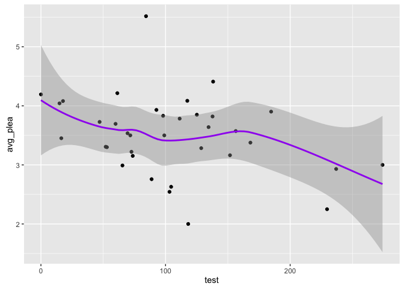
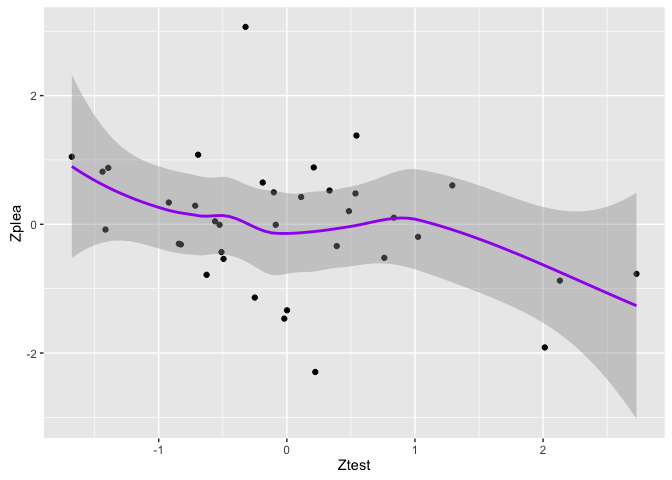
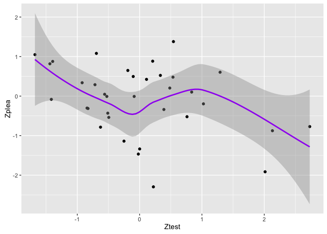
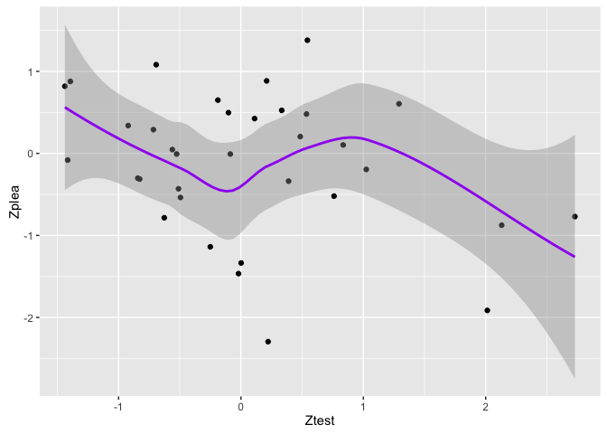
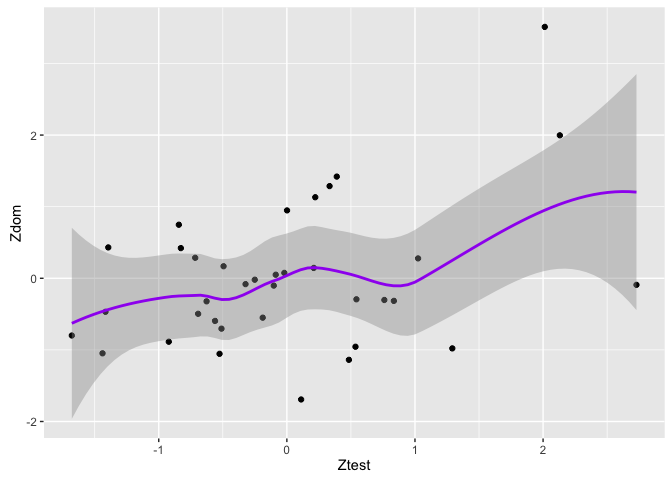
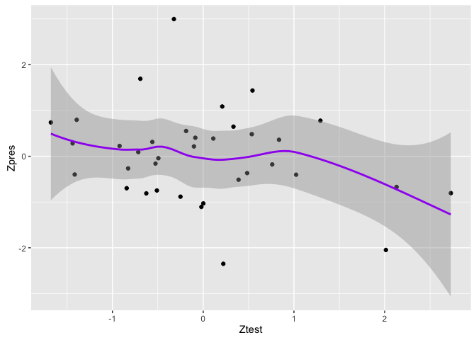
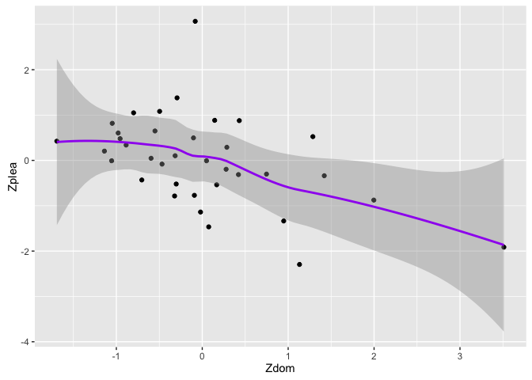
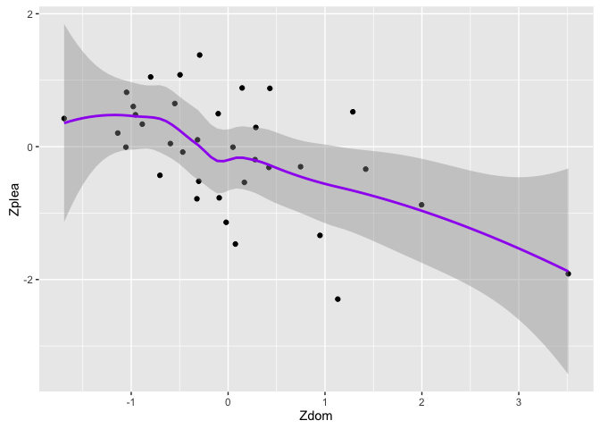
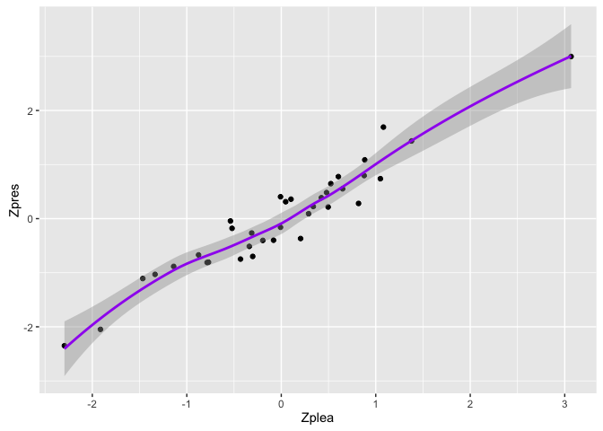

GraphsT1
================
Marlise Hofer
November 19, 2016

Exploring the T Study 1 data for only women
===========================================

    ## Loading tidyverse: ggplot2
    ## Loading tidyverse: tibble
    ## Loading tidyverse: tidyr
    ## Loading tidyverse: readr
    ## Loading tidyverse: purrr
    ## Loading tidyverse: dplyr

    ## Conflicts with tidy packages ----------------------------------------------

    ## filter(): dplyr, stats
    ## lag():    dplyr, stats

Plot T against pleasantness & compute correlation
=================================================

ave\_ple=plesantness

    ## 
    ##  Pearson's product-moment correlation
    ## 
    ## data:  data$avg_plea and data$test
    ## t = -2.003, df = 34, p-value = 0.0532
    ## alternative hypothesis: true correlation is not equal to 0
    ## 95 percent confidence interval:
    ##  -0.590399281  0.004093072
    ## sample estimates:
    ##        cor 
    ## -0.3248795

Exact same results with Zscored variables
=========================================

Pleasantness has one variable with Zscore of over 3
===================================================

What happens when we filter out that variable?

    ## 
    ##  Pearson's product-moment correlation
    ## 
    ## data:  data1$Zplea and data1$Ztest
    ## t = -2.1345, df = 33, p-value = 0.04032
    ## alternative hypothesis: true correlation is not equal to 0
    ## 95 percent confidence interval:
    ##  -0.61066749 -0.01703154
    ## sample estimates:
    ##        cor 
    ## -0.3483012

Now let's check while also removing the clean shirt
===================================================

    ## 
    ##  Pearson's product-moment correlation
    ## 
    ## data:  data2$Zplea and data2$Ztest
    ## t = -1.7957, df = 32, p-value = 0.08199
    ## alternative hypothesis: true correlation is not equal to 0
    ## 95 percent confidence interval:
    ##  -0.58125265  0.03966659
    ## sample estimates:
    ##        cor 
    ## -0.3025576

Okay, now I'll look at graphs of dominance and prestige with T
==============================================================

    ## 
    ##  Pearson's product-moment correlation
    ## 
    ## data:  data$Zdom and data$Ztest
    ## t = 2.5114, df = 34, p-value = 0.01694
    ## alternative hypothesis: true correlation is not equal to 0
    ## 95 percent confidence interval:
    ##  0.07705418 0.64082897
    ## sample estimates:
    ##       cor 
    ## 0.3955759

    ## 
    ##  Pearson's product-moment correlation
    ## 
    ## data:  data$Zpres and data$Ztest
    ## t = -1.5999, df = 34, p-value = 0.1189
    ## alternative hypothesis: true correlation is not equal to 0
    ## 95 percent confidence interval:
    ##  -0.54570356  0.07001486
    ## sample estimates:
    ##        cor 
    ## -0.2646075

Now I'll look at a graph of dominance with pleasantness
=======================================================

    ## 
    ##  Pearson's product-moment correlation
    ## 
    ## data:  data$Zplea and data$Zdom
    ## t = -3.2306, df = 34, p-value = 0.002741
    ## alternative hypothesis: true correlation is not equal to 0
    ## 95 percent confidence interval:
    ##  -0.7014800 -0.1856581
    ## sample estimates:
    ##        cor 
    ## -0.4846335

Pleasantness has one variable with Zscore of over 3
===================================================

What happens when we filter out that variable?

    ## 
    ##  Pearson's product-moment correlation
    ## 
    ## data:  data4$Zplea and data4$Ztest
    ## t = -2.1345, df = 33, p-value = 0.04032
    ## alternative hypothesis: true correlation is not equal to 0
    ## 95 percent confidence interval:
    ##  -0.61066749 -0.01703154
    ## sample estimates:
    ##        cor 
    ## -0.3483012

Graphs of prestige with pleasantness
====================================

    ## 
    ##  Pearson's product-moment correlation
    ## 
    ## data:  data$Zplea and data$Zpres
    ## t = 19.968, df = 34, p-value < 2.2e-16
    ## alternative hypothesis: true correlation is not equal to 0
    ## 95 percent confidence interval:
    ##  0.9222030 0.9795343
    ## sample estimates:
    ##       cor 
    ## 0.9599088

There seems to be no indication of any quadratic effects
========================================================
